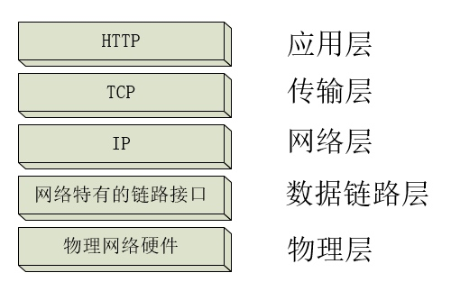
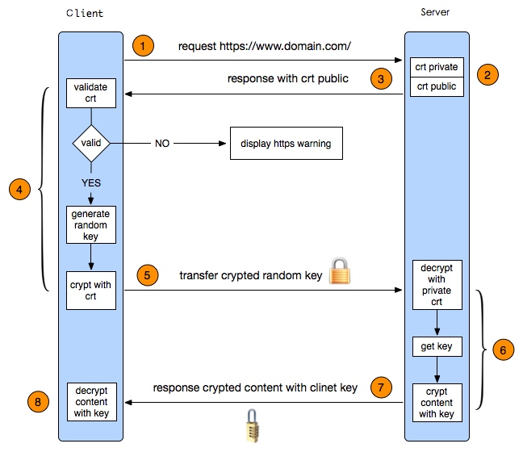
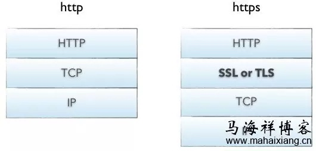
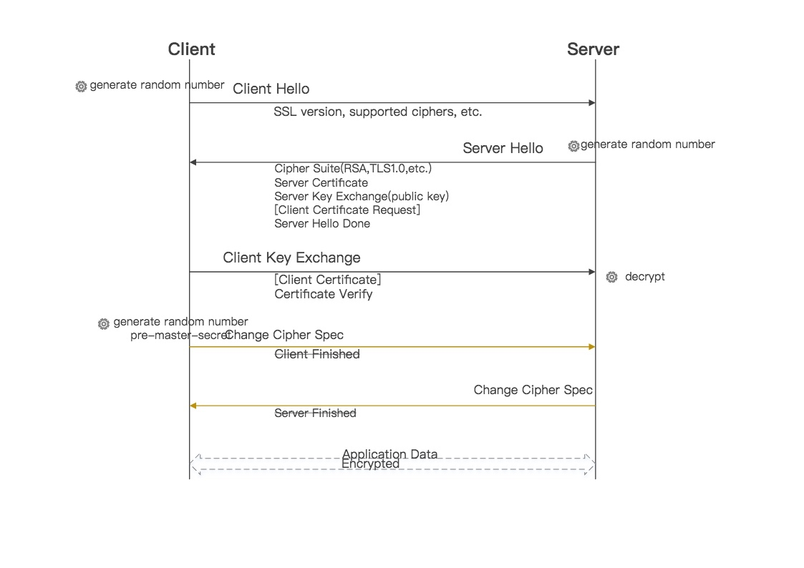

# HTTP基础和必记

##HTTP
[HTTP面试必记忆](http://www.cnblogs.com/jackson0714/p/HTTP1.html)
### 什么是HTTP协议?

HTTP:超文本传输协议。使用的是可靠的数据传输协议，在传输的过程中不会被损坏或产生混乱。HTTP可以从遍布全世界的Web服务器商将各种信息块迅速、便捷、可靠地搬移到人们桌面上的Web浏览器上去。

### MIME类型是什么？

MIME：多用途因特网邮件扩展。最初设计MIME是为了解决在不同的电子邮件系统之间搬移报文时存在的问题。HTTP采纳了它，用来描述并标记多媒体内容。

MIME类型时一种文本标记，标识一种主要的对象类型和一个特定的子类型，中间由一条斜杠来分隔。如text/html,text/plain,image/ipeg。常见的MIME类型有数百个。


### 什么是URI？

URI：统一资源标识符，在世界范围内唯一标识并定位信息资源。

URI有两种形式：URL和URN。

### 什么是URL？

URL：统一资源定位符。URL描述了一台特定服务器上某资源的特定位置。

URL的第一部分被称为方案（scheme）。说明了访问资源所使用的协议类型。这里使用的时HTTP协议（http://）。

第二部分表示服务器的因特网地址：www.cnblogs.com。

其余部分指定了Web服务器上的某个资源：/jackson0714/p/algorithm_1.html。

几乎所有的URLI都是URL。

### 常见的HTTP方法有哪些？

| GET    | 从服务器向客户端发送命名资源                     |
| ------ | ------------------------------------------------ |
| PUT    | 将来自客户端的数据存储到一个命名的服务器资源中去 |
| DELETE | 从服务器中删除命名资源                           |
| POST   | 将客户端数据发送到一个服务器网关应用程序         |
| HEAD   | 仅发送命名资源响应中的HTTP首部                   |
|        |                                                  |

### HTTP method

1. 一台服务器要与HTTP1.1兼容，只要为资源实现**GET**和**HEAD**方法即可
2. **GET**是最常用的方法，通常用于**请求服务器发送某个资源**。
3. **HEAD**与GET类似，但**服务器在响应中值返回首部，不返回实体的主体部分**
4. **PUT**让服务器**用请求的主体部分来创建一个由所请求的URL命名的新文档，或者，如果那个URL已经存在的话，就用干这个主体替代它**
5. **POST**起初是用来向服务器输入数据的。实际上，通常会用它来支持HTML的表单。表单中填好的数据通常会被送给服务器，然后由服务器将其发送到要去的地方。
6. **TRACE**会在目的服务器端发起一个环回诊断，最后一站的服务器会弹回一个TRACE响应并在响应主体中携带它收到的原始请求报文。TRACE方法主要用于诊断，用于验证请求是否如愿穿过了请求/响应链。
7. **OPTIONS**方法请求web服务器告知其支持的各种功能。可以查询服务器支持哪些方法或者对某些特殊资源支持哪些方法。
8. **DELETE**请求服务器删除请求URL指定的资源

### GET和POST的详细区别

1. 1) Get:从服务器请求数据，而且请求包含在Url之中，如：

    /test/demo_form.asp?name1=value1&name2=value2

    有长度限制；可以用来作电子书签；敏感数据不应该用Get请求；可以缓存；保存在浏览器历史记录之中；仅仅用来检索数据

2. 2) Post:提交数据到服务器，如：

```http
    POST /test/demo_form.asp HTTP/1.1

    Host: w3schools.com

    name1=value1&name2=value2
```
不可以缓存；不存在浏览历史记录当中；没有长度限制；不可用作电子书签；POST请求相对GET请求更加安全；

3. GET被强制服务器支持

    All general-purpose servers MUST support the methods GET and HEAD. All other methods are OPTIONAL.

    GET 通常用于请求服务器发送某个资源。在HTTP/1.1中，要求服务器实现此方法；POST请求方法起初是用来向服务器输入数据的。在HTTP/1.1中，POST方法是可选被实现的，没有明确规定要求服务器实现。

4. 浏览器对URL的长度有限制，所以GET请求不能代替POST请求发送大量数据

    RFC 2616 (Hypertext Transfer Protocol — HTTP/1.1) states in section 3.2.1 that there is no limit to the length of an URI (URI is the official term for what most people call a URL)

    RFC 2616 中明确对 uri 的长度并没有限制。不过虽然在RFC中并没有对uri的长度进行限制，但是各大浏览器厂家在实现的时候限制了URL的长度，可查到的是IE对长度限制为2083；而chrome遇到长度很长的URL时，会直接崩溃。

    所以这条结论算是正确的。

5. GET请求发送数据更小

    只能通过写代码验证了：下面第一个文件是服务器代码，作用是在客户端发送GET和POST请求的时候返回200状态码。第二个文件是客户端HTML文件，点击两个button，分别发送GET请求和POST请求。

6. GET请求是幂等的

A request method is considered "idempotent" if the intended effect on the server of multiple identical requests with that method is the same as the effect for a single such request. Of the request methods defined by this specification, PUT, DELETE, and safe request methods are idempotent.

从上面可以看到GET请求是安全的，在幂等性中说PUT和DELETE以及安全method都是幂等的，所以GET自然也被包括了。

作者：雅然风懿
链接：https://www.jianshu.com/p/63158ec1f1f9
來源：简书
著作权归作者所有。商业转载请联系作者获得授权，非商业转载请注明出处。

### 从浏览器地址栏输入url到显示页面的步骤(以HTTP为例)

1. 在浏览器地址栏输入URL
2. 浏览器查看**缓存**，如果请求资源在缓存中并且新鲜，跳转到转码步骤
    1. 如果资源未缓存，发起新请求
    2. 如果已缓存，检验是否足够新鲜，足够新鲜直接提供给客户端，否则与服务器进行验证。
    3. 检验新鲜通常有两个HTTP头进行控制`Expires`和`Cache-Control`：
        - HTTP1.0提供Expires，值为一个绝对时间表示缓存新鲜日期
        - HTTP1.1增加了Cache-Control: max-age=,值为以秒为单位的最大新鲜时间
3. 浏览器**解析URL**获取协议，主机，端口，path
4. 浏览器**组装一个HTTP（GET）请求报文**
5. 浏览器**获取主机ip地址**，过程如下：
    1. 浏览器缓存
    2. 本机缓存
    3. hosts文件
    4. 路由器缓存
    5. ISP DNS缓存
    6. DNS递归查询（可能存在负载均衡导致每次IP不一样）
6. **打开一个socket与目标IP地址，端口建立TCP链接**，三次握手如下：
    1. 客户端发送一个TCP的**SYN=1，Seq=X**的包到服务器端口
    2. 服务器发回**SYN=1， ACK=X+1， Seq=Y**的响应包
    3. 客户端发送**ACK=Y+1， Seq=Z**
7. TCP链接建立后**发送HTTP请求**
8. 服务器接受请求并解析，将请求转发到服务程序，如虚拟主机使用HTTP Host头部判断请求的服务程序
9. 服务器检查**HTTP请求头是否包含缓存验证信息**如果验证缓存新鲜，返回**304**等对应状态码
10. 处理程序读取完整请求并准备HTTP响应，可能需要查询数据库等操作
11. 服务器将**响应报文通过TCP连接发送回浏览器**
12. 浏览器接收HTTP响应，然后根据情况选择**关闭TCP连接或者保留重用，关闭TCP连接的四次握手如下**：
    1. 主动方发送**Fin=1， Ack=Z， Seq= X**报文
    2. 被动方发送**ACK=X+1， Seq=Z**报文
    3. 被动方发送**Fin=1， ACK=X， Seq=Y**报文
    4. 主动方发送**ACK=Y， Seq=X**报文
13. 浏览器检查响应状态吗：是否为1XX，3XX， 4XX， 5XX，这些情况处理与2XX不同
14. 如果资源可缓存，**进行缓存**
15. 对响应进行**解码**（例如gzip压缩）
16. 根据资源类型决定如何处理（假设资源为HTML文档）
17. **解析HTML文档，构件DOM树，下载资源，构造CSSOM树，执行js脚本**，这些操作没有严格的先后顺序，以下分别解释
18. **构建DOM树**：
    1. **Tokenizing**：根据HTML规范将字符流解析为标记
    2. **Lexing**：词法分析将标记转换为对象并定义属性和规则
    3. **DOM construction**：根据HTML标记关系将对象组成DOM树
19. 解析过程中遇到图片、样式表、js文件，**启动下载**
20. 构建**CSSOM树**：
    1. **Tokenizing**：字符流转换为标记流
    2. **Node**：根据标记创建节点
    3. **CSSOM**：节点创建CSSOM树
21. **[根据DOM树和CSSOM树构建渲染树](https://developers.google.com/web/fundamentals/performance/critical-rendering-path/render-tree-construction)**:
    1. 从DOM树的根节点遍历所有**可见节点**，不可见节点包括：1）`script`,`meta`这样本身不可见的标签。2)被css隐藏的节点，如`display: none`
    2. 对每一个可见节点，找到恰当的CSSOM规则并应用
    3. 发布可视节点的内容和计算样式
22. **js解析如下**：
    1. 浏览器创建Document对象并解析HTML，将解析到的元素和文本节点添加到文档中，此时**document.readystate为loading**
    2. HTML解析器遇到**没有async和defer的script时**，将他们添加到文档中，然后执行行内或外部脚本。这些脚本会同步执行，并且在脚本下载和执行时解析器会暂停。这样就可以用document.write()把文本插入到输入流中。**同步脚本经常简单定义函数和注册事件处理程序，他们可以遍历和操作script和他们之前的文档内容**
    3. 当解析器遇到设置了**async**属性的script时，开始下载脚本并继续解析文档。脚本会在它**下载完成后尽快执行**，但是**解析器不会停下来等它下载**。异步脚本**禁止使用document.write()**，它们可以访问自己script和之前的文档元素
    4. 当文档完成解析，document.readState变成interactive
    5. 所有**defer**脚本会**按照在文档出现的顺序执行**，延迟脚本**能访问完整文档树**，禁止使用document.write()
    6. 浏览器**在Document对象上触发DOMContentLoaded事件**
    7. 此时文档完全解析完成，浏览器可能还在等待如图片等内容加载，等这些**内容完成载入并且所有异步脚本完成载入和执行**，document.readState变为complete,window触发load事件
23. **显示页面**（HTML解析过程中会逐步显示页面）
   

### HTTP报文

HTTP报文都向着下游流动。
HTTP报文是由一行一行的简单的字符串组成的。HTTP报文都是纯文本，不是二进制代码。

请求报文：从Web客户端发往Web服务器的HTTP报文称为请求报文。

响应报文：从Web服务器发往客户端的报文称为响应报文。

HTTP报文包含以下三个部分：

起始行：报文的第一行就是起始行，在请求报文中用来说明要做些什么，在响应报文中说明出现了什么情况。如：GET /jackson0714/p/algorithm_1.html HTTP/1.1

首部字段：起始行后面由零个或多个首部字段。以键值对的形式表示首部字段。键和值之间用冒号分隔。首部以一个空行结束。如Content-Type：text/html:charset=utf-8

主体：首部字段空行之后就是可选的报文主体了，其中包含了所有类型的数据。请求主体中包括了要发送Web服务器的数据，响应主体中装载了要返回给客户端的数据。

### HTTP报文的组成

简单的格式化数据块


1. 起始行
    起始行和首部就是由行分隔的ASCII文本，每行都以一个由两个字符组成的行终止序列作为结束CRLF
2. 首部
3. 主体
    是一个可选的数据块，可以包含文本或者二进制数据，也可以为空。


### HTTP request报文结构是怎样的
[rfc2616](http://www.w3.org/Protocols/rfc2616/rfc2616-sec5.html)中进行了定义：

1. 首行是**Request-Line**包括：**请求方法**，**请求URI**，**协议版本**，**CRLF**
2. 首行之后是若干行**请求头**，包括**general-header**，**request-header**或者**entity-header**，每个一行以CRLF结束
3. 请求头和消息实体之间有一个**CRLF分隔**
4. 根据实际请求需要可能包含一个**消息实体**
  一个请求报文例子如下：

```
GET /Protocols/rfc2616/rfc2616-sec5.html HTTP/1.1
Host: www.w3.org
Connection: keep-alive
Cache-Control: max-age=0
Accept: text/html,application/xhtml+xml,application/xml;q=0.9,image/webp,*/*;q=0.8
User-Agent: Mozilla/5.0 (Windows NT 6.1; WOW64) AppleWebKit/537.36 (KHTML, like Gecko) Chrome/35.0.1916.153 Safari/537.36
Referer: https://www.google.com.hk/
Accept-Encoding: gzip,deflate,sdch
Accept-Language: zh-CN,zh;q=0.8,en;q=0.6
Cookie: authorstyle=yes
If-None-Match: "2cc8-3e3073913b100"
If-Modified-Since: Wed, 01 Sep 2004 13:24:52 GMT

name=qiu&age=25
```

### HTTP response报文结构是怎样的

[rfc2616](http://www.w3.org/Protocols/rfc2616/rfc2616-sec6.html)中进行了定义：

1. 首行是状态行包括：**HTTP版本，状态码，状态描述**，后面跟一个CRLF
2. 首行之后是**若干行响应头**，包括：**通用头部，响应头部，实体头部**
3. 响应头部和响应实体之间用**一个CRLF空行**分隔
4. 最后是一个可能的**消息实体**
  响应报文例子如下：

```
HTTP/1.1 200 OK
Date: Tue, 08 Jul 2014 05:28:43 GMT
Server: Apache/2
Last-Modified: Wed, 01 Sep 2004 13:24:52 GMT
ETag: "40d7-3e3073913b100"
Accept-Ranges: bytes
Content-Length: 16599
Cache-Control: max-age=21600
Expires: Tue, 08 Jul 2014 11:28:43 GMT
P3P: policyref="http://www.w3.org/2001/05/P3P/p3p.xml"
Content-Type: text/html; charset=iso-8859-1

{"name": "qiu", "age": 25}
```

### HTTP协议栈是怎么样的

HTTP是应用层协议。它把联网的细节都交给了通用、可靠的因特网传输协议TCP\IP协议。

HTTP网络协议栈:


TCP协议：

　　a.传输控制协议

　　b.无差错的数据传输

　　c.按序传输（数据总是会按照发送的顺序到达）

　　d.未分段的数据流（可以在任意时刻以任意尺寸将数据发送出去）
　　
### 什么是DNS？

域名解析服务。将主机名转换为IP地址。如将http://www.cnblogs.com/主机名转换为IP地址：211.137.51.78。

### 什么是网关？

网关是一种特殊的服务器，作为其他服务器的中间实体使用。通常用于将HTTP流量转换成其他的协议。

### 什么是隧道？

隧道是建立起来之后，就会在两条连接之间对原始数据进行盲转发的HTTP应用程序。常见用途是通过HTTP连接承载加密的安全套接字层（SSL）流量，这样SSL流量就可以穿过只允许Web流量通过的防火墙了

### 报文的语法

1. 请求报文

```
method request-URL version
headers

entity-body
```

2. 响应报文

```
version status reason-phrase
headers

entity-body
```


### HTTP和HTTPS的区别



服务端和客户端的信息传输都会通过TLS进行加密，所以传输的数据都是加密后的数据。具体是如何进行加密，解密，验证的，且看下图。

（1）客户端发起https请求

就是简单地发起请求，和http没什么两样。用户在浏览器中输入一个https网址，就会尝试连接服务端的443端口（http会访问80端口）。

（2）服务端的配置
采用https协议的服务器必须要有一套数字证书，可以自己制作，也可以向组织申请。

区别是：自己颁发的证书需要客户端验证通过，才可以继续访问，而使用受信任的公司申请的证书则不会弹出提示页面(startssl就是个不错的选择，有1年的免费服务)。

这套证书其实就是一对公钥和私钥。如果对公钥和私钥不太理解，可以想象成一把钥匙和一个锁头，全世界只有你一个人有这把钥匙。你可以把锁头（公钥）传给别人，别人可以用这个锁把重要的东西锁起来，然后发给你。因为只有你一个人有这把钥匙，所以只有你才能看到被这把锁锁起来的东西。

（3）传送证书
公钥只是证书的一部分。完整的证书包含了公钥、证书的颁发机构、过期时间等等信息。

（4）客户端解析证书
这部分工作是有客户端的tls（安全传输层协议）来完成的。

首先，会验证公钥是否有效，比如颁发机构，过期时间等等。如果发现异常，则会弹出一个警告框，提示证书存在问题。如果证书没有问题，那么就生成一个随机值，然后用证书对该随机值进行加密。接着，把随机值用锁头（公钥）锁起来，这样除非有钥匙（私钥），不然看不到被锁住的内容。

（5）传送加密信息
这部分传送的是用证书加密后的随机值，目的就是让服务端得到这个随机值，以后客户端和服务端的通信就可以通过这个随机值来进行加密解密了。

6）服务段解密信息
服务端用私钥（服务端保留的私钥）解密收到的信息后，就能得到客户端传过来的随机值（客户端传来的私钥），然后把内容通过该值进行对称加密（所谓对称加密就是，将信息和私钥通过某种算法混合在一起，这样除非知道私钥，不然无法获取内容）。因为客户端和服务端都知道这个私钥（客户端传来的私钥），所以只要加密算法够彪悍，私钥够复杂，数据就够安全。

（7）传输加密后的信息
这部分信息是服务端用私钥加密后的信息，可以在客户端被解密还原。

（8） 客户端解密信息
客户端用之前生成的私钥解密服务端传过来的信息，最后获取了解密后的内容。整个过程第三方即使监听到了数据，也束手无策。

至于https，整个传输过程中传递的数据包都是加密的。第三方只能在1、3、5、7步截取到数据包（1是访问的地址信息，3是证书（大家都有），5、7都是加密后的数据）。由于缺少两种秘钥，这些信息对攻击者来说都是无用的，这就保证了数据传输的安全。

那么问题来了，https是否绝对意义上的安全呢？答案是否定的，要注意“慎防内鬼”。举个例子，假如客户端浏览器存在漏洞，可以获取第4步生成的随机值，并且给攻击者得知，那么整个加密过程就失去意义了。如果服务端存在内鬼，知道服务端自带的私钥，那么就能解密第5步传来的数据，获取客户端的私钥，那么整个传输过程（对攻击者而言）就是透明的。

五、HTTPS要比HTTP多用多少服务器资源？



HTTP使用TCP三次握手建立连接，客户端和服务器需要交换3个包（具体可查看马海祥博客《HTTP服务的七层架构技术解析及运用》的相关介绍）；HTTPS除了TCP的三个包，还要加上ssl握手需要的9个包，所以一共是12个包。

六、HTTPS的优点

正是由于HTTPS非常的安全，攻击者无法从中找到下手的地方，从站长的角度来说，HTTPS的优点有以下2点：

1、SEO方面

谷歌曾在2014年8月份调整搜索引擎算法，并称“比起同等HTTP网站，采用HTTPS加密的网站在搜索结果中的排名将会更高”。

2、安全性

尽管HTTPS并非绝对安全，掌握根证书的机构、掌握加密算法的组织同样可以进行中间人形式的攻击，但HTTPS仍是现行架构下最安全的解决方案，主要有以下几个好处：

（1）、使用HTTPS协议可认证用户和服务器，确保数据发送到正确的客户机和服务器；

（2）、HTTPS协议是由SSL+HTTP协议构建的可进行加密传输、身份认证的网络协议，要比http协议安全，可防止数据在传输过程中不被窃取、改变，确保数据的完整性。

（3）、HTTPS是现行架构下最安全的解决方案，虽然不是绝对安全，但它大幅增加了中间人攻击的成本。

七、HTTPS的缺点

2、经济方面

（1）、SSL证书需要钱，功能越强大的证书费用越高，个人网站、小网站没有必要一般不会用。

（2）、SSL证书通常需要绑定IP，不能在同一IP上绑定多个域名，IPv4资源不可能支撑这个消耗（SSL有扩展可以部分解决这个问题，但是比较麻烦，而且要求浏览器、操作系统支持，Windows XP就不支持这个扩展，考虑到XP的装机量，这个特性几乎没用）。

（3）、HTTPS连接缓存不如HTTP高效，大流量网站如非必要也不会采用，流量成本太高。

（4）、HTTPS连接服务器端资源占用高很多，支持访客稍多的网站需要投入更大的成本，如果全部采用HTTPS，基于大部分计算资源闲置的假设的VPS的平均成本会上去。

（5）、HTTPS协议握手阶段比较费时，对网站的相应速度有负面影响，如非必要，没有理由牺牲用户体验。

### 客户端识别机制及cookie机制
HTTP是一个匿名无状态的请求/响应协议。所有有了cookie。

用户识别机制：
- 承载用户信息的HTTP首部
- 客户端IP地址跟踪
- 用户登录，用认证方式来识别用户
- 胖URL，在URL中嵌入个人识别信息的技术
- cookie 持久的身份识别技术。


1. 首部法

1. From
2. User-Agent
3. Referer
4. Authorrization
5. client-ip
6. x-forwarded-for
7. Cookie

2. IP法

3. 用户登录法

### cookie
[简书](https://www.jianshu.com/p/bdbae99a3871)
cookie类型：会话cookie和持久cookie

存在于http header里


cookie、session区别
cookie 存储于浏览器端，而 session 存储于服务端
cookie 的安全性相比于 session 较弱，别人可以分析存放在本地的COOKIE并进行COOKIE欺骗
考虑到安全应当使用session。
session 会在一定时间内保存在服务器上。当访问增多时，会占用服务器的资源，所以考虑到服务器性能方面，可以使用cookie
cookie 存储容量有限制，单个cookie 保存数据不能超过4k，且很多浏览器限制一个站点最多保存20个cookie。而对于 session ，其默认大小一般是1024k

作者：落沙w
链接：https://www.jianshu.com/p/bdbae99a3871
來源：简书
著作权归作者所有。商业转载请联系作者获得授权，非商业转载请注明出处。

### cookie的分类

（1）会话cookie。临时cookie，记录了用户访问站点时的设置和偏好。用户退出浏览器时，会话cookie就被删除了。

（2）持久cookie。持久cookie的生存时间更长一些；它们存储在硬盘上，浏览器退出，计算机重启时它们仍然存在。通常会用持久cookie维护某个用户会周期性访问的站点的配置文件或登录名。

唯一区别就是它们的过期时间。如果设置了Discard参数或没有设置Expires或没有设置Max-Age参数则说明这个cookie就是一个会话cookie。

### Cookie的工作原理？

（1）用户首次访问Web站点时，Web服务器对用户一无所知。

（2）Web服务器通过Set-Cookie首部将cookie存放到浏览器中的cookie数据库中。cookie中包含了N个键值对，例如Cookie: id=“1234”。cookie中可以包含任意信息，但它们通常都只包含一个服务器为了进行跟踪而产生的独特的识别码。

（3）将来用户再次访问同一站点时，浏览器会从cookie数据库中挑中那个服务器设置的cookie，并在cookie请求首部中（Cookie: id=“1234”）将其传回给服务器。

（4）服务器可以通过id="1234"这个键值对来查找服务器为其访问积累的信息（购物历史、地址信息等）。

注意：cookie并不仅限与ID号。很多Web服务器都会将信息直接保存在cooki中。比如Cookie： name="Tom"; phone="111-2222"

### cookie的缺点？

存在安全隐患。第三方Web站点使用持久cookie来跟踪用户就是对cookie一种最大的滥用。将这种做法与IP地址和Referer首部信息结合在一起，这些营销公司就可以构建起相当精确的用户档案和浏览模式信息。


### 如何使用cookie

| **Set-Cookie属性** | **说明**                                                     | **例子**                                                     |
| ------------------ | ------------------------------------------------------------ | ------------------------------------------------------------ |
| NAME=VALUE         | 强制的。NAME和VALUE都是字符序列。Web服务器可以创建任意的NAME=VALUE关联，在后继对站点的访问中会将其送回给Web服务器： | Set-Cookie：Name=Tom                                         |
| Expires            | 可选的。日期字符串。定义cookie的实际生存期。一旦过了过期日期，就不再存储或发布这个cookie了。 | Set-Cookie：Name=Tom; expires=Wednesday,09-Nov-99 20:00:00 GMT |
| Domain             | 可选的。浏览器只向指定域中的服务器主机名发送cookie。这样服务器就将cookie限制在了特定的域中。 | Set-Cookie：Name=Tom; domain:"cnblogs.com"                   |
| Path               | 可选的。通过这个属性可以位服务器上特定的文档分配cookie。     | Set-Cookie：Name=Tom; path=/abc用户访问http://www.abc123.com 可能获得一个cookie: Name=Tom；当用户访问http://www.abc123.com/test.html  可能获得两个cookie，其中一个是之前已经获得cookie: Name=Tom，另外一个是cookie:page=test。 |
| Secure             | 可选的。如果包含了这一属性，就只有在HTTP使用SSL安全连接时才会发送cookie。 | Set-Cookie：Name=Tom; secure                                 |
|                    |                                                              |                                                              |


### 安全HTTP

HTTPS是最流行的HTTP安全形势。是网景公司首创
HTTPS对所有的请求和响应数据在发送到网络之前，都要进行加密。
HTTPS在HTTP下面提供了一个传输级的密码安全层。可以使用SSL或者TSL
大部分情况下，只需要对SSL的输入输出取代TCP的调用就行了

### HTTPS细节介绍

建立安全传输

### SSL握手
在发送和已加密的HTTP报文之前，客户端和服务器要进行一次SSL握手，在SSL握手中，要完成以下工作。

- 交换协议的版本号
- 选择一个两端都了解的密码
- 对两端的身份进行认证
- 生成临时会话密钥


### 强缓存

4. 思路4， 缓存+更新机制升级版

比如：浏览器第一次请求a.jpg 时，服务器会发送完整的文件并附带额外信息

Cache-Control: max-age=300；
浏览器把文件和附带信息保存起来。当再次需要a.jpg 时，如果是在300秒以内发起的请求则直接使用缓存(200, from xx cache)，否则重新发起网络请求(200)。下面是Cache-Control常见的几个值：

Public表示响应可被任何中间节点缓存，如 Browser <-- proxy1 <--  proxy2 <-- Server，中间的proxy可以缓存资源，比如下次再请求同一资源proxy1直接把自己缓存的东西给 Browser 而不再向proxy2要。
Private表示中间节点不允许缓存，对于Browser <-- proxy1 <--  proxy2 <-- Server，proxy 会老老实实把Server 返回的数据发送给proxy1,自己不缓存任何数据。当下次Browser再次请求时proxy会做好请求转发而不是自作主张给自己缓存的数据。
no-cache表示不使用 Cache-Control的缓存控制方式做前置验证，而是使用 Etag 或者Last-Modified字段来控制缓存
no-store ，真正的不缓存任何东西。浏览器会直接向服务器请求原始文件，并且请求中不附带 Etag 参数(服务器认为是新请求)。
max-age，表示当前资源的有效时间，单位为秒。
优点：缓存控制功能更强大

缺点：假如浏览器再次请求资源a.jpg的时间间隔超过了max-age，这时候向服务器发送请求服务器应该会重新返回a.jpg的完整文件。但如果 a.jpg 在服务器上未做任何修改，发送a.jpg的完整文件就太浪费带宽了，其实只要发送一个「a.jpg未被更改」的短消息标示就好了。

5. 思路5， 缓存+更新机制终极版

比如：浏览器第一次请求a.jpg 时，服务器会发送完整的文件并附带额外信息，其中Etag 是 对a.jpg文件的编码，如果a.jpg在服务端未被修改，这个值就不会变


Cache-Control: max-age=300；
ETag:W/"e-cbxLFQW5zapn79tQwb/g6Q"
浏览器把a.jpg和额外信息保存到本地。假如浏览器在300秒以内再次需要获取a.jpg时，浏览器直接从缓存读取a.jpg(200, from xx cache)。假如浏览器在300秒之后再次需要获取a.jpg时，浏览器发现该缓存的文件已经不新鲜了，于是就向服务器发送请求 重新获取a.jpg, 在发送请求的时候附带刚刚保存的a.jpg的ETag ( If-None-Match：W/"e-cbxLFQW5zapn79tQwb/g6Q")。 服务器在接收到请求后拿浏览器请求的 Etag 和当前文件重新计算后端 Etag 做个比较，如果二者相等表示文件在未修改则发送个短消息（响应头，不包含图片内容, 304），如果二者不等则发送新文件和新的 ETag，浏览器获取新文件并更新该文件的 Etag。

与 ETag 类似功能的是Last-Modified/If-Modified-Since。当资源过期时（max-age超时），发现资源具有Last-Modified声明，则再次向web服务器请求时带上头 If-Modified-Since，表示请求时间。web服务器收到请求后发现有头If-Modified-Since 则与被请求资源的最后修改时间进行比对。若最后修改时间较新，说明资源又被改动过，则响应整片资源内容（200）；若最后修改时间较旧，说明资源无新修改，则响应HTTP 304 ，告知浏览器继续使用所保存的cache。


1. 配置超长时间的本地缓存 —— 节省带宽，提高性能
2. 采用内容摘要作为缓存更新依据 —— 精确的缓存控制
3. 静态资源CDN部署 —— 优化网络请求
4. 更资源发布路径实现非覆盖式发布 —— 平滑升级


    这就是相对比较完整的静态资源缓存控制方案，还要注意的是，静态资源的缓存控制要求在前端所有静态资源加载的位置都要做这样的处理。

怎么让浏览器不缓存静态资源

实际上, 工作中很多场景都需要避免浏览器缓存, 除了浏览器隐私模式, 请求时想要禁用缓存, 还可以设置请求头: Cache-Control: no-cache, no-store, must-revalidate .

当然, 还有一种常用做法: 即给请求的资源增加一个版本号, 如下:
```
<link rel="stylesheet" type="text/css" href="../css/style.css?version=1.8.9"/>
1
```
这样做的好处就是你可以自由控制什么时候加载最新的资源.

不仅如此, HTML也可以禁用缓存, 即在页面的\节点中加入\标签, 代码如下:

```
<meta http-equiv="Cache-Control" content="no-cache, no-store, must-revalidate"/>
1
```
上述虽能禁用缓存, 但只有部分浏览器支持, 而且由于代理不解析HTML文档, 故代理服务器也不支持这种方式.

no-cache : 相当于max-age:0,must-revalidate即资源被缓存, 但是缓存立刻过期, 同时下次访问时强制验证资源有效性

### SSL握手
https://segmentfault.com/a/1190000002554673



