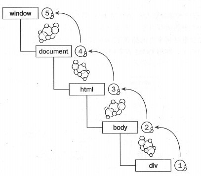
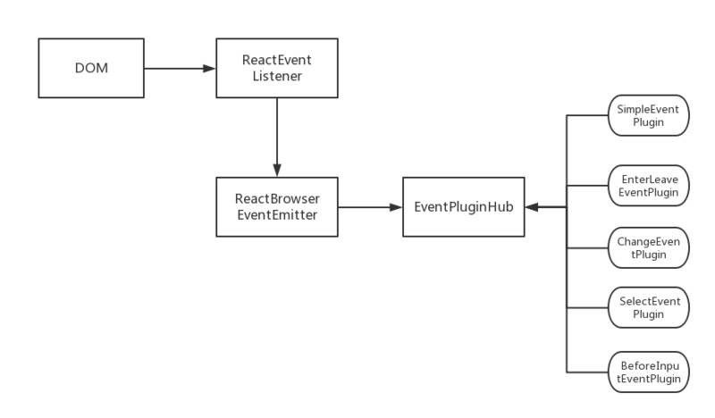

# React
## 基础知识
### 组件的生命周期


组件生命周期有三种阶段：初始化阶段（Mounting）、更新阶段（Updating）、析构阶段（Unmouting）。

**初始化阶段：**

- constructor()：初始化state、绑定事件
- componentWillMount()：在render()之前执行，除了同构，跟constructor没啥差别
- render()：用于渲染DOM。如果有操作DOM或和浏览器打交道的操作，最好在下一个步骤执行。
- componentDidMount()：在render()之后立即执行，可以在这个函数中对DOM就进行操作，可以加载服务器数据，可以使用setState()方法触发重新渲染

**组件更新阶段：**

- componentWillReceiveProps(nextProps)：在已挂载的组件接收到新props时触发，传进来的props没有变化也可能触发该函数，若需要实现props变化才执行操作的话需要自己手动判断
- componentShouldUpdate(nextProps，nextState)：默认返回true，我们可以手动判断需不需要触发render，若返回false，就不触发下一步骤
- componentWillUpdate()：componentShouldUpdate返回true时触发，在render之前，可以在里面进行操作DOM
- render()：重渲染
- componentDidUpdate()：render之后立即触发

组件卸载阶段：

- componentWillUnmount()：在组件销毁之前触发，可以处理一些清理操作，如无效的timers等
- componentDidMount()：卸载后立即触发


生命周期


### React解决了什么问题？

**a. React实现了Virtual DOM**

在一定程度上提升了性能，尤其是在进行小量数据更新时。因为DOM操作是很耗性能的，而Virtual DOM是在内存中进行操作的，当数据发生变化时，通过diff算法比较两棵树之间的变化，再进行必要的DOM更新，省去了不必要的高消耗的DOM操作。当然，这种性能优化主要体现在有小量数据更新的情况下。因为React的基本思维模式是每次有变动就重新渲染整个应用，简单想来就是直接重置innerHTML，比如说在一个大型列表所有数据都变动的情况下，重置innerHTML还比较合理，但若是只有一行数据变了，它也需要重置整个innerHTML，就会造成大量的浪费。而Virtual DOM虽然进行了JS层面的计算，但是比起DOM操作来说，简直不要太便宜。

> [为什么操作真实DOM比React更快？](https://www.zhihu.com/question/31809713)

**b. React的一个核心思想是声明式编程。**

命令式编程是解决做什么的问题，就像是下命令一样，关注于怎么做，而声明式编程关注于得到什么结果，在React中，我们只需要关注“目前的状态是什么”，而不是“我需要做什么让页面变成目前的状态”。React就是不断声明，然后在特定的参数下渲染UI界面。这种编程方式可以让我们的代码更容易被理解，从而易于维护。

**c. 组件化**

React天生组件化，我们可以将一个大的应用分割成很多小组件，这样有好几个优势。首先组件化的代码像一棵树一样清楚干净，比起传统的面条式代码可读性更高；其次前端人员在开发过程中可以并行开发组件而不影响，大大提高了开发效率；最重要的是，组件化使得复用性大大提高，团队可以沉淀一些公共组件或工具库。

**d. 单向数据流**

在React中数据流是单向的，由父节点流向子节点，如果父节点的props发生了变化，那么React会递归遍历整个组件树，重新渲染所有使用该属性的子组件。这种单向的数据流一方面比较清晰不容易混乱，另一方面是比较好维护，出了问题也比较好定位。

### 如何设计一个好组件

组件的主要目的是为了更好的复用，所以在设计组件的时候需要遵循高内聚低耦合的原则。

- 可以通过遵循几种设计模式原则来达到高复用的目的，比如单一职责原则：React推崇的是“组合”而非“继承”，所以在设计时尽量不设计大的组件，而是开发若干个单一功能的组件，重点就是每个组件只做一件事；开放/封闭原则，就是常说的对修改封闭，对扩展开放。在React中我们可以用高阶组件来实现。
- 使用高阶组件来实现组件的复用。高阶组件就是一个包装了另一个React组件的React组件，它包括属性代理（高阶组件操控着传递给被包裹组件的属性）和反向继承（实际上高阶组件继承被包裹组件）。我们可以用高阶组件实现代码复用，逻辑抽象。
- 使用容器组件来处理逻辑，展示组件来展示数据（也就是逻辑处理与数据展示分离）。比如可以在容器组件中进行数据的请求与处理，然后将处理后的数据传递给展示组件，展示组件只负责展示，这样容器组件和展示组件就可以更好地复用了。
- 编写组件代码时要符合规范，总之就是要可读性强、复用性高、可维护性好。


### 组件的render函数何时被调用

- 组件state发生改变时会调用render函数，比如通过setState函数改变组件自身的state值
- 继承的props属性发生改变时也会调用render函数，即使改变的前后值一样
- React生命周期中有个s### 调用render时DOM就一定会被更新吗

不一定更新。

React组件中存在两类DOM，render函数被调用后， React会根据props或者state重新创建一棵virtual DOM树，虽然每一次调用都重新创建，但因为创建是发生在内存中，所以很快不影响性能。而 virtual dom的更新并不意味着真实DOM的更新，React采用diff算法将virtual DOM和真实DOM进行比较，找出需要更新的最小的部分，这时Real DOM才可能发生修改。

所以每次state的更改都会使得render函数被调用，但是页面DOM不一定发生修改。houldcomponentUpdate函数，默认返回true，即允许render被调用，我们也可以重写这个函数，判断是否应该调用render函数


### 调用render时DOM就一定会被更新吗

不一定更新。

React组件中存在两类DOM，render函数被调用后， React会根据props或者state重新创建一棵virtual DOM树，虽然每一次调用都重新创建，但因为创建是发生在内存中，所以很快不影响性能。而 virtual dom的更新并不意味着真实DOM的更新，React采用diff算法将virtual DOM和真实DOM进行比较，找出需要更新的最小的部分，这时Real DOM才可能发生修改。

所以每次state的更改都会使得render函数被调用，但是页面DOM不一定发生修改。

### 进行远程数据加载时，应该在哪个周期中完成

- 最好是在`componentDidMount`中进行异步请求。如果我们将ajax请求放在生命周期其他函数中，如`constructor`或`componentWIllMount`中，我们并不能保证请求仅在组件挂载完毕后才响应。如果我们的数据请求在组件挂载前就完成，并调用`setState`函数将数据添加到组件状态中，对于未挂载的组件会报错。而在`componentDidMount`中进行ajax请求能有效避免这个问题。

```js
  Warning: setState(...): Can only update a mounted or mounting component. This usually means you called setState() on an unmounted component.
```

- React 下一代调和算法 Fiber 会通过开始或停止渲染的方式优化应用性能，其会影响到 `componentWillMount` 的触发次数。对于 `componentWillMount` 这个生命周期函数的调用次数会变得不确定，React 可能会多次频繁调用 `componentWillMount`。如果我们将 AJAX 请求放到 `componentWillMount` 函数中，那么显而易见其会被触发多次，自然也就不是好的选择。[没深入]

顺便说说`componentWillMount`函数，这个方法是在`render`前立刻执行的，也是服务器渲染中唯一调用的钩子，其实除了同构的需求，通常情况下可以用`constructor()`方法代替。

### 在哪些生命周期中可以修改组件的state

- componentDidMount和componentDidUpdate
- constructor、componentWillMount中setState会发生错误：setState只能在mounted或mounting组件中执行
- componentWillUpdate中setState会导致死循环

### 不同父节点的组件需要对彼此的状态进行改变时应该怎么实现

- 在没有Flux之前，Facebook推荐使用事件机制，但是一旦应用中这种需求增多，事件和回调会满天飞
- 传递接口，就是需要root传递两个接口给A和B，当A想改变B的状态时，A调用root传递给它的接口，然后这个接口再调用root传给B的接口（这个方法也很不科学）
- 用Flux管理状态


### state里应该有什么

应该有啥：

- 事件函数可能进行修改的会导致UI进行渲染的数据

不应该有啥：

- 计算得出的值
- React组件
- props复制来的数据

### 如何对组件进行优化

- 使用上线构建（Production Build）：会移除脚本中不必要的报错和警告，减少文件体积
- 避免重绘：重写shouldComponentUpdate函数，手动控制是否应该调用render函数进行重绘
- 尽可能使用Immutable Data：尽可能不修改数据，而是重新赋值数据。这样在检测数据对象是否发生修改方面会非常快，因为只需要检测对象引用即可，不需要挨个检测对象属性的更改
- 在渲染组件时尽可能添加key，这样virtual DOM在对比的时候就更容易知道哪里是修改元素，哪里是新插入的元素


### 组件中的key属性有什么用

React中的key是一个特殊的属性，它的出现不是给开发者用的，而是给React自己用的（给一个组件设置了key属性，并不能获取这个组件的key props）

React使用key来识别组件，它是一种身份标识，每一个key对应一个组件，react认为相同的key是同一个组件，这样后续相同的key就不会被创建

有了key属性后，就可以与组件建立一种对应关系，react根据key来决定是销毁重新创建组件还是更新组件：

- key相同：若组件属性有变化，react只更新对应的属性；没有变化则不更新
- key值不同：react会先销毁该组件，然后重新创建该组件

### Component与Element和Instance的区别

- Element其实是一个纯粹的Object对象，用于描述在屏幕上看到的DOM节点，这个对象包括type、props、key和ref属性，但不包括DOM方法（React.createElement()）
- Component是组件级别的类：接收参数并返回React元素的函数或类
- Instance：当使用ReactDOM.render()将一个组件渲染到一个具体的DOM元素中，返回的值就为一个实例

### 调用setState时，发生了什么事

调用setState时，react会做的第一件事就是将传递给setState的对象合并到组件的当前状态，然后会触发调和过程。经过调和过程，React会以相对高效的方式根据新的状态构建React元素树，并准备重新渲染整个UI界面。在React得到元素树后，React会通过diff算法算出新的树与老树之间的节点差异，然后根据差异对界面进行最小化重渲染。在diff算法中，React能够相对精确地算出哪些位置发生了改变以及应该如何改变，这就保证了按需更新，而不是全部重新渲染。


### 什么时候使用类组件（Class Component）而非功能组件（Functional Component）

若组件需要有state或需要使用生命周期，就用类组件，否则就用功能组件

### 什么是React的refs，为什么它们很重要

我们用render方法得到了组价的实例，然后就可以对它进行相关操作，但是在组件内，JSX是不会返回一个组件的实例，它只是一个ReactElement，只是告诉React被挂载的组件应该是长什么样。

refs是组件的一个很特殊的prop，可以附加到任何一个组件上，refs就是reference，组件被调用时会新建一个该组件的实例，refs就会指向这个实例

我们把refs放到原生的DOM组件input中，就可以通过refs得到DOM结点；如果把refs放到React组件中，就可以获得组件的实例，可以调用该组件的实例方法

### 受控组件（controlled component）和不受控组件（uncontrolled component）有什么区别

受控组件：在HTML中，标签\、\等值的改变通常是根据用户输入进行更新，在React中，可变状态通常保存在组件的状态属性中，并且只能用setState()更新，而呈现表单的React组件也控制着在后续用户输入时该表单发生的情况，以这种由React控制输入表单元素而改变其值的方式，就称为“受控组件”

不受控组件：表单数据不受setState控制，而是由DOM本身处理，与传统HTML表单输入相似，input输入值即显示最新值（使用ref从DOM获取表单值）

### React的事件机制
其实React事件并没有原生的绑定在真实的DOM上，而是使用了行为委托方式实现事件机制。



如上图所示，在JavaScript中，事件的触发实质上是要经过三个阶段:事件捕获、目标对象本身的事件处理和事件冒泡，假设在div中触发了click事件，实际上首先经历捕获阶段会由父级元素将事件一直传递到事件发生的元素，执行完目标事件本身的处理事件后，然后经历冒泡阶段，将事件从子元素向父元素冒泡。正因为事件在DOM的传递经历这样一个过程，从而为行为委托提供了可能。通俗地讲，行为委托的实质就是将子元素事件的处理委托给父级元素处理。React会将所有的事件都绑定在最外层(document)，使用统一的事件监听，并在冒泡阶段处理事件，当挂载或者卸载组件时，只需要在通过的在统一的事件监听位置增加或者删除对象，因此可以提高效率。

并且React并没有使用原生的浏览器事件，而是在基于Virtual DOM的基础上实现了合成事件(SyntheticEvent)，事件处理程序接收到的是SyntheticEvent的实例。SyntheticEvent完全符合W3C的标准，因此在事件层次上具有浏览器兼容性，与原生的浏览器事件一样拥有同样的接口，可以通过stopPropagation()和preventDefault()相应的中断。如果需要访问当原生的事件对象，可以通过引用nativeEvent获得。




　上图为大致的React事件机制的流程图，React中的事件机制分为两个阶段:事件注册和事件触发:
　
- 事件注册　　
　　React在组件加载(mount)和更新(update)时,其中的ReactDOMComponent会对传入的事件属性进行处理，对相关事件进行注册和存储。document中注册的事件不处理具体的事件，仅对事件进行分发。ReactBrowserEventEmitter作为事件注册入口，担负着事件注册和事件触发。注册事件的回调函数由EventPluginHub来统一管理，根据事件的类型(type)和组件标识(_rootNodeID)为key唯一标识事件并进行存储。
　　
- 事件执行
　　事件执行时，document上绑定事件ReactEventListener.dispatchEvent会对事件进行分发，根据之前存储的类型(type)和组件标识(_rootNodeID)找到触发事件的组件。ReactEventEmitter利用EventPluginHub中注入(inject)的plugins(例如:SimpleEventPlugin、EnterLeaveEventPlugin)会将原生的DOM事件转化成合成的事件，然后批量执行存储的回调函，回调函数的执行分为两步，第一步是将所有的合成事件放到事件队列里面，第二步是逐个执行。需要注意的是，浏览器原生会为每个事件的每个listener创建一个事件对象，可以从这个事件对象获取到事件的引用。这会造成高额的内存分配，React在启动时就会为每种对象分配内存池，用到某一个事件对象时就可以从这个内存池进行复用，节省内存。

就能阻止原生的事件传播，其实在事件委托的情形下是不能实现这一点的。当然解决的办法也不复杂,不要将React事件和DOM原生事件混用。


总结

- React在virtual DOM的基础上实现了一个SyntheticEvent（合成事件）层，所有事件都绑定到最外层上。

- 在React底层，主要对合成事件做了两件事：事件委托和自动绑定。

    - 事件委托：React的事件代理机制不会把事件处理函数直接绑定到真实的结点上，而是把所有事件绑定到结构的最外层，使用统一的事件监听器，这个事件监听器上维持了一个映射来保存所有组件内部的事件监听和处理函数。当事件发生时，首先被这个统一的事件监听器处理，然后在映射里找到真正的事件处理函数并调用。

    - 自动绑定：在React组件中，每个方法的上下文都会指向该组件的实例，即自动绑定this为当前组件。在使用ES6 classes和纯函数时，这种自动绑定就不存在了，需要我们手动绑定this：bind方法、双冒号语法、构造器内声明、箭头函数。


### 调用 setState 之后发生了什么？

- 在代码中调用setState函数之后，React 会将传入的参数对象与组件当前的状态合并，然后触发所谓的调和过程（Reconciliation）。
- 经过调和过程，React 会以相对高效的方式根据新的状态构建 React 元素树并且着手重新渲染整个UI界面。
- 在 React 得到元素树之后，React 会自动计算出新的树与老树的节点差异，然后根据差异对界面进行最小化重渲染。
- 在差异计算算法中，React 能够相对精确地知道哪些位置发生了改变以及应该如何改变，这就保证了按需更新，而不是全部重新渲染。


### react diff算法
[diff算法](https://zhuanlan.zhihu.com/p/20346379)

三个层面的diff

- tree-diff
- component-diff
- element-diff

总结：

- React 通过制定大胆的 diff 策略，将 O(n3) 复杂度的问题转换成 O(n) 复杂度的问题；

- React 通过分层求异的策略，对 tree diff 进行算法优化；

- React 通过相同类生成相似树形结构，不同类生成不同树形结构的策略，对 component diff 进行算法优化；

- React 通过设置唯一 key的策略，对 element diff 进行算法优化；

建议，在开发组件时，保持稳定的 DOM 结构会有助于性能的提升；

建议，在开发过程中，尽量减少类似将最后一个节点移动到列表首部的操作，当节点数量过大或更新操作过于频繁时，在一定程度上会影响 React 的渲染性能。


