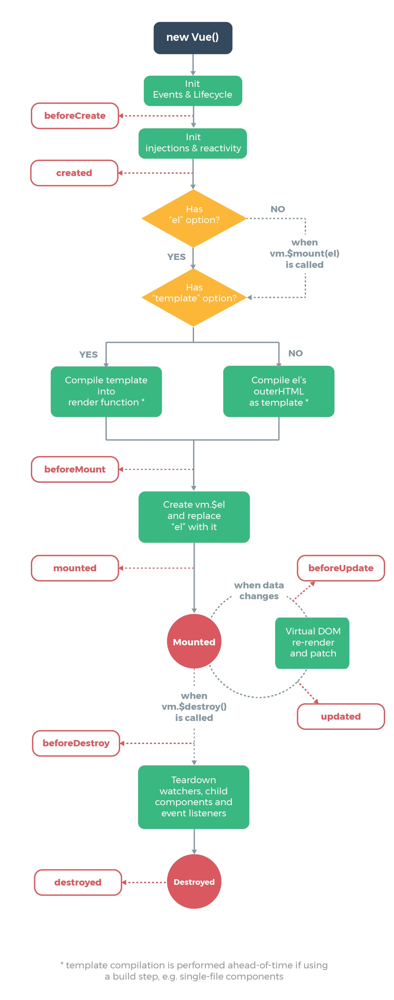
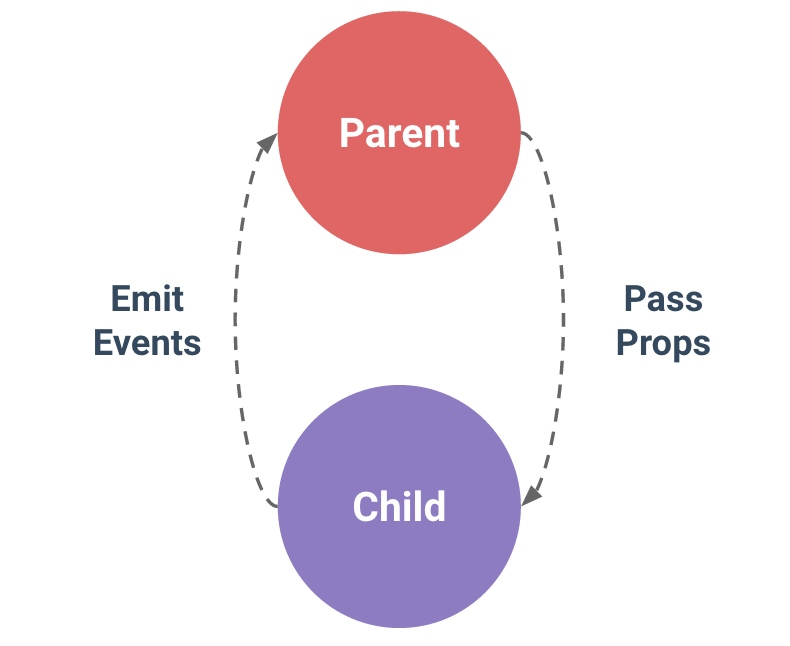
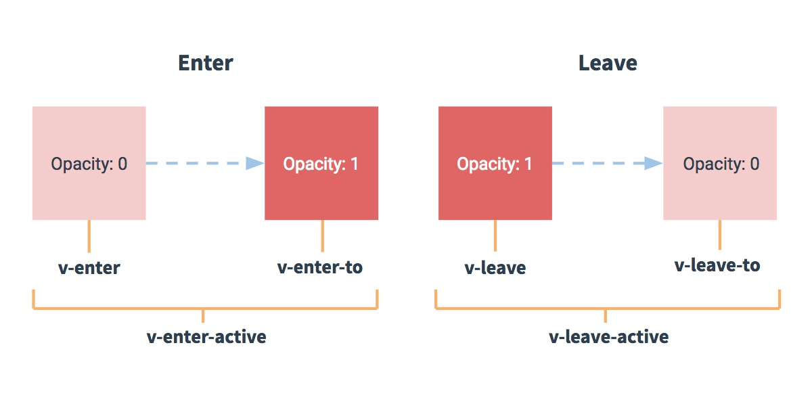
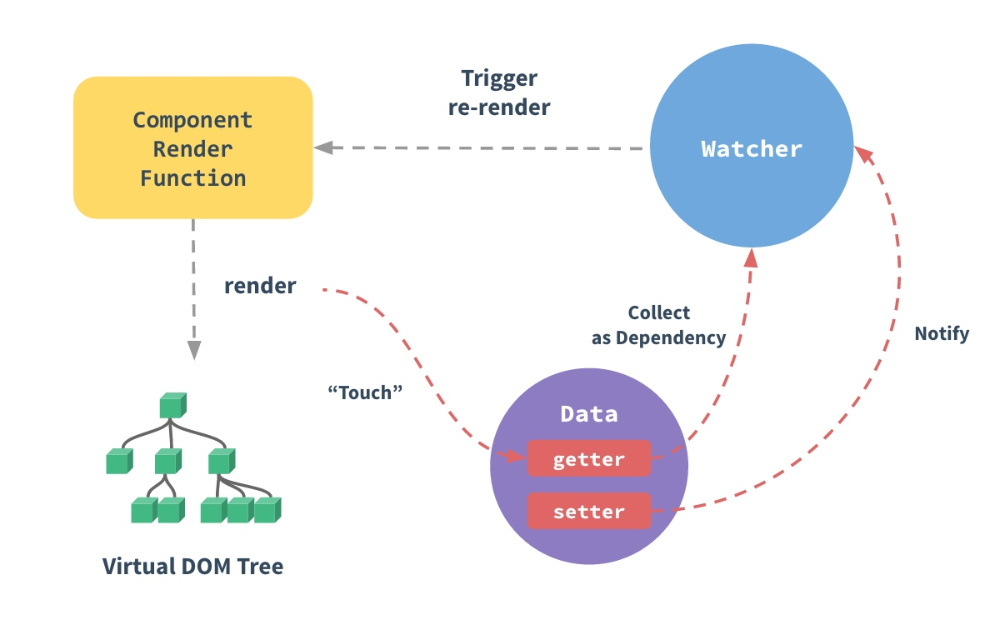

# VUE基本问题


## VUE

vue文档阅读笔记

1. 生命周期



注意： 不要在选项属性或回调上使用箭头函数，比如 created: () => console.log(this.a) 或 vm.$watch('a', newValue => this.myMethod())。因为箭头函数是和父级上下文绑定在一起的，this 不会是如你所预期的 Vue 实例，经常导致 Uncaught TypeError: Cannot read property of undefined 或 Uncaught TypeError: this.myMethod is not a function 之类的错误。


这些表达式会在所属 Vue 实例的数据作用域下作为 JavaScript 被解析。有个限制就是，每个绑定都只能包含单个表达式，所以下面的例子都不会生效。

<!-- 这是语句，不是表达式 -->
`{{ var a = 1 }}`

<!-- 流控制也不会生效，请使用三元表达式 -->
`{{ if (ok) { return message } }}`
模板表达式都被放在沙盒中，只能访问全局变量的一个白名单，如 Math 和 Date 。你不应该在模板表达式中试图访问用户定义的全局变量。

修饰符
修饰符 (Modifiers) 是以半角句号 . 指明的特殊后缀，用于指出一个指令应该以特殊方式绑定。例如，.prevent 修饰符告诉 v-on 指令对于触发的事件调用 event.preventDefault()：

<form v-on:submit.prevent="onSubmit">...</form>
在接下来对 v-on 和 v-for 等功能的探索中，你会看到修饰符的其它例子。

v-bind 缩写
<!-- 完整语法 -->
<a v-bind:href="url">...</a>

<!-- 缩写 -->
<a :href="url">...</a>

v-on 缩写
<!-- 完整语法 -->
<a v-on:click="doSomething">...</a>

<!-- 缩写 -->
<a @click="doSomething">...</a>

### 计算属性

```vue
var vm = new Vue({
  el: '#example',
  data: {
    message: 'Hello'
  },
  computed: {
    // 计算属性的 getter
    reversedMessage: function () {
      // `this` 指向 vm 实例
      return this.message.split('').reverse().join('')
    }
  }
})
```

计算属性缓存 vs 方法

### 计算属性的 setter

计算属性默认只有 getter ，不过在需要时你也可以提供一个 setter ：

// ...
computed: {
  fullName: {
    // getter
    get: function () {
      return this.firstName + ' ' + this.lastName
    },
    // setter
    set: function (newValue) {
      var names = newValue.split(' ')
      this.firstName = names[0]
      this.lastName = names[names.length - 1]
    }
  }
}
// ...
现在再运行 vm.fullName = 'John Doe' 时，setter 会被调用，vm.firstName 和 vm.lastName 也会相应地被更新。


虽然计算属性在大多数情况下更合适，但有时也需要一个自定义的侦听器。这就是为什么 Vue 通过 watch 选项提供了一个更通用的方法，来响应数据的变化。当需要在数据变化时执行异步或开销较大的操作时，这个方式是最有用的。

注意，v-show 不支持 <template> 元素，也不支持 v-else。

v-if vs v-show
v-if 是“真正”的条件渲染，因为它会确保在切换过程中条件块内的事件监听器和子组件适当地被销毁和重建。

v-if 也是惰性的：如果在初始渲染时条件为假，则什么也不做——直到条件第一次变为真时，才会开始渲染条件块。

相比之下，v-show 就简单得多——不管初始条件是什么，元素总是会被渲染，并且只是简单地基于 CSS 进行切换。

一般来说，v-if 有更高的切换开销，而 v-show 有更高的初始渲染开销。因此，如果需要非常频繁地切换，则使用 v-show 较好；如果在运行时条件很少改变，则使用 v-if 较好。

v-if 与 v-for 一起使用
当 v-if 与 v-for 一起使用时，v-for 具有比 v-if 更高的优先级。

建议尽可能在使用 v-for 时提供 key，除非遍历输出的 DOM 内容非常简单，或者是刻意依赖默认行为以获取性能上的提升。

因为它是 Vue 识别节点的一个通用机制，key 并不与 v-for 特别关联，key 还具有其他用途，我们将在后面的指南中看到其他用途。


变异方法
Vue 包含一组观察数组的变异方法，所以它们也将会触发视图更新。这些方法如下：

push()
pop()
shift()
unshift()
splice()
sort()
reverse()
你打开控制台，然后用前面例子的 items 数组调用变异方法：example1.items.push({ message: 'Baz' }) 。

### 变异数组？
替换数组
变异方法 (mutation method)，顾名思义，会改变被这些方法调用的原始数组。相比之下，也有非变异 (non-mutating method) 方法，例如：filter(), concat() 和 slice() 。这些不会改变原始数组，但总是返回一个新数组。当使用非变异方法时，可以用新数组替换旧数组：

example1.items = example1.items.filter(function (item) {
  return item.message.match(/Foo/)
})
你可能认为这将导致 Vue 丢弃现有 DOM 并重新渲染整个列表。幸运的是，事实并非如此。Vue 为了使得 DOM 元素得到最大范围的重用而实现了一些智能的、启发式的方法，所以用一个含有相同元素的数组去替换原来的数组是非常高效的操作。

### 注意事项

注意事项
由于 JavaScript 的限制，Vue 不能检测以下变动的数组：

当你利用索引直接设置一个项时，例如：vm.items[indexOfItem] = newValue
当你修改数组的长度时，例如：vm.items.length = newLength
为了解决第一类问题，以下两种方式都可以实现和 vm.items[indexOfItem] = newValue 相同的效果，同时也将触发状态更新：

// Vue.set
Vue.set(example1.items, indexOfItem, newValue)
// Array.prototype.splice
example1.items.splice(indexOfItem, 1, newValue)
为了解决第二类问题，你可以使用 splice：

example1.items.splice(newLength)


### 注意对对象的更改

对象更改检测注意事项
还是由于 JavaScript 的限制，Vue 不能检测对象属性的添加或删除：

var vm = new Vue({
  data: {
    a: 1
  }
})
// `vm.a` 现在是响应式的

vm.b = 2
// `vm.b` 不是响应式的
对于已经创建的实例，Vue 不能动态添加根级别的响应式属性。但是，可以使用 Vue.set(object, key, value) 方法向嵌套对象添加响应式属性。例如，对于：

var vm = new Vue({
  data: {
    userProfile: {
      name: 'Anika'
    }
  }
})
你可以添加一个新的 age 属性到嵌套的 userProfile 对象：

Vue.set(vm.userProfile, 'age', 27)
你还可以使用 vm.$set 实例方法，它只是全局 Vue.set 的别名：

vm.$set(vm.userProfile, 'age', 27)

有时你可能需要为已有对象赋予多个新属性，比如使用 Object.assign() 或 _.extend()。在这种情况下，你应该用两个对象的属性创建一个新的对象。所以，如果你想添加新的响应式属性，不要像这样：

Object.assign(vm.userProfile, {
  age: 27,
  favoriteColor: 'Vue Green'
})
你应该这样做：

vm.userProfile = Object.assign({}, vm.userProfile, {
  age: 27,
  favoriteColor: 'Vue Green'
})


注意这里的 is="todo-item" 属性。这种做法在使用 DOM 模板时是十分必要的，因为在 <ul> 元素内只有 <li> 元素会被看作有效内容。这样做实现的效果与 <todo-item> 相同，但是可以避开一些潜在的浏览器解析错误。查看 DOM 模板解析说明 来了解更多信息。


使用修饰符时，顺序很重要；相应的代码会以同样的顺序产生。因此，用 v-on:click.prevent.self 会阻止所有的点击，而 v-on:click.self.prevent 只会阻止对元素自身的点击。


不要把 .passive 和 .prevent 一起使用，因为 .prevent 将会被忽略，同时浏览器可能会向你展示一个警告。请记住，.passive 会告诉浏览器你不想阻止事件的默认行为。

为什么在 HTML 中监听事件?
你可能注意到这种事件监听的方式违背了关注点分离 (separation of concern) 这个长期以来的优良传统。但不必担心，因为所有的 Vue.js 事件处理方法和表达式都严格绑定在当前视图的 ViewModel 上，它不会导致任何维护上的困难。实际上，使用 v-on 有几个好处：

扫一眼 HTML 模板便能轻松定位在 JavaScript 代码里对应的方法。

因为你无须在 JavaScript 里手动绑定事件，你的 ViewModel 代码可以是非常纯粹的逻辑，和 DOM 完全解耦，更易于测试。

当一个 ViewModel 被销毁时，所有的事件处理器都会自动被删除。你无须担心如何自己清理它们。


### 模板解析注意事项

当使用 DOM 作为模板时 (例如，使用 el 选项来把 Vue 实例挂载到一个已有内容的元素上)，你会受到 HTML 本身的一些限制，因为 Vue 只有在浏览器解析、规范化模板之后才能获取其内容。尤其要注意，像 <ul>、<ol>、<table>、<select> 这样的元素里允许包含的元素有限制，而另一些像 <option> 这样的元素只能出现在某些特定元素的内部。

在自定义组件中使用这些受限制的元素时会导致一些问题，例如：
```
<table>
  <my-row>...</my-row>
</table>
```
自定义组件 <my-row> 会被当作无效的内容，因此会导致错误的渲染结果。变通的方案是使用特殊的 is 特性：
```
<table>
  <tr is="my-row"></tr>
</table>
```
应当注意，如果使用来自以下来源之一的字符串模板，则没有这些限制：
```
<script type="text/x-template">
JavaScript 内联模板字符串
.vue 组件
```

### 组件的data必须是函数

data 必须是函数
构造 Vue 实例时传入的各种选项大多数都可以在组件里使用。只有一个例外：data 必须是函数。实际上，如果你这么做：

### 通信
在 Vue 中，父子组件的关系可以总结为 prop 向下传递，事件向上传递。父组件通过 prop 给子组件下发数据，子组件通过事件给父组件发送消息。看看它们是怎么工作的。




组件实例的作用域是孤立的。这意味着不能 (也不应该) 在子组件的模板内直接引用父组件的数据。父组件的数据需要通过 prop 才能下发到子组件中。

子组件要显式地用 props 选项声明它预期的数据：
```
Vue.component('child', {
  // 声明 props
  props: ['message'],
  // 就像 data 一样，prop 也可以在模板中使用
  // 同样也可以在 vm 实例中通过 this.message 来使用
  template: '<span>{{ message }}</span>'
})
```
然后我们可以这样向它传入一个普通字符串：
```
<child message="hello!"></child>
```
### v-model的几个属性

.lazy
.number
.trim

### 自定义事件：实现子组件向父组件通信

父组件可以在使用子组件的地方直接使用v-on来监听子组件触发的事件。
详细步骤
1. 在父组件作用域中，定义v-on

```js
<div id="counter-event-example">
  <p>{{ total }}</p>
  <button-counter v-on:increment="incrementTotal"></button-counter>
  <button-counter v-on:increment="incrementTotal"></button-counter>
</div>
```

2. 在子组件的作用域中，定义事件，并在某个方法中触发事件，这样就完全解耦了

```js
Vue.component('button-counter', {
  template: '<button v-on:click="incrementCounter">{{ counter }}</button>',
  data: function () {
    return {
      counter: 0
    }
  },
  methods: {
    incrementCounter: function () {
      this.counter += 1
      this.$emit('increment')
    }
  },
})

new Vue({
  el: '#counter-event-example',
  data: {
    total: 0
  },
  methods: {
    incrementTotal: function () {
      this.total += 1
    }
  }
})
```
### v-model详解

### 非父子组件的通信
设置一个空的Vue实例作为事件总线

### 编写可复用的组件

在编写组件时，最好考虑好以后是否要进行复用。一次性组件间有紧密的耦合没关系，但是可复用组件应当定义一个清晰的公开接口，同时也不要对其使用的外层数据作出任何假设。

Vue 组件的 API 来自三部分——prop、事件和插槽：

Prop 允许外部环境传递数据给组件；

事件允许从组件内触发外部环境的副作用；

插槽允许外部环境将额外的内容组合在组件中。

使用 v-bind 和 v-on 的简写语法，模板的意图会更清楚且简洁：

### 异步组件

### v-once的使用方式

### 动画



### vue状态管理

使用store模式，将状态集中管理。

### 深入响应式原理

Vue 最独特的特性之一，是其非侵入性的响应式系统。数据模型仅仅是普通的 JavaScript 对象。而当你修改它们时，视图会进行更新。这使得状态管理非常简单直接，不过理解其工作原理同样重要，这样你可以回避一些常见的问题。在这个章节，我们将进入一些 Vue 响应式系统的底层的细节。

如何追踪变化？

当你把一个普通的 JavaScript 对象传给 Vue 实例的 data 选项，Vue 将遍历此对象所有的属性，并使用 Object.defineProperty 把这些属性全部转为 getter/setter。Object.defineProperty 是 ES5 中一个无法 shim 的特性，这也就是为什么 Vue 不支持 IE8 以及更低版本浏览器的原因。

用户看不到 getter/setter，但是在内部它们让 Vue 追踪依赖，在属性被访问和修改时通知变化。这里需要注意的问题是浏览器控制台在打印数据对象时 getter/setter 的格式化并不同，所以你可能需要安装 vue-devtools 来获取更加友好的检查接口。

每个组件实例都有相应的 watcher 实例对象，它会在组件渲染的过程中把属性记录为依赖，之后当依赖项的 setter 被调用时，会通知 watcher 重新计算，从而致使它关联的组件得以更新。



所谓依赖收集是不是就是：每个组件都有对应的watcher对象，它会在组件的渲染过程中把属性记录为依赖，之后当依赖项的setter被调用时，会通知watcher重新计算，从而导致他关联的组件更新

可能你还没有注意到，Vue 异步执行 DOM 更新。只要观察到数据变化，Vue 将开启一个队列，并缓冲在同一事件循环中发生的所有数据改变。如果同一个 watcher 被多次触发，只会被推入到队列中一次。这种在缓冲时去除重复数据对于避免不必要的计算和 DOM 操作上非常重要。然后，在下一个的事件循环“tick”中，Vue 刷新队列并执行实际 (已去重的) 工作。Vue 在内部尝试对异步队列使用原生的 Promise.then 和 MessageChannel，如果执行环境不支持，会采用 setTimeout(fn, 0) 代替。

例如，当你设置 vm.someData = 'new value' ，该组件不会立即重新渲染。当刷新队列时，组件会在事件循环队列清空时的下一个“tick”更新。多数情况我们不需要关心这个过程，但是如果你想在 DOM 状态更新后做点什么，这就可能会有些棘手。虽然 Vue.js 通常鼓励开发人员沿着“数据驱动”的方式思考，避免直接接触 DOM，但是有时我们确实要这么做。为了在数据变化之后等待 Vue 完成更新 DOM ，可以在数据变化之后立即使用 Vue.nextTick(callback) 。这样回调函数在 DOM 更新完成后就会调用。例如：

### 和react
React 和 Vue 有许多相似之处，它们都有：

使用 Virtual DOM
提供了响应式 (Reactive) 和组件化 (Composable) 的视图组件。
将注意力集中保持在核心库，而将其他功能如路由和全局状态管理交给相关的库。
由于有着众多的相似处，我们会用更多的时间在这一块进行比较。这里我们不只保证技术内容的准确性，同时也兼顾了平衡的考量。我们需要承认 React 比 Vue 更好的地方，比如更丰富的生态系统。

React 社区为我们准确进行平衡的考量提供了非常积极的帮助，特别感谢来自 React 团队的 Dan Abramov 。他非常慷慨的花费时间来贡献专业知识来帮助我们完善这篇文档。

优化
在 React 应用中，当某个组件的状态发生变化时，它会以该组件为根，重新渲染整个组件子树。

如要避免不必要的子组件的重渲染，你需要在所有可能的地方使用 PureComponent，或是手动实现 shouldComponentUpdate 方法。同时你可能会需要使用不可变的数据结构来使得你的组件更容易被优化。

然而，使用 PureComponent 和 shouldComponentUpdate 时，需要保证该组件的整个子树的渲染输出都是由该组件的 props 所决定的。如果不符合这个情况，那么此类优化就会导致难以察觉的渲染结果不一致。这使得 React 中的组件优化伴随着相当的心智负担。

在 Vue 应用中，组件的依赖是在渲染过程中自动追踪的，所以系统能精确知晓哪个组件确实需要被重渲染。你可以理解为每一个组件都已经自动获得了 shouldComponentUpdate，并且没有上述的子树问题限制。

Vue 的这个特点使得开发者不再需要考虑此类优化，从而能够更好地专注于应用本身。

### vuex框架原理及源码分析

集中与MVC中的Model层，所有的数据必须通过`action-mutation-state change`的流程来进行，
主要讲这几个问题
先将问题抛出来，使学习和研究更有针对性：

使用Vuex只需执行 Vue.use(Vuex)，并在Vue的配置中传入一个store对象的示例，store是如何实现注入的？
state内部是如何实现支持模块配置和模块嵌套的？
在执行dispatch触发action（commit同理）的时候，只需传入（type, payload），action执行函数中第一个参数store从哪里获取的？
如何区分state是外部直接修改，还是通过mutation方法修改的？
调试时的“时空穿梭”功能是如何实现的？


### vue-angular的区别

### 说说你对angular脏检查理解？

在angular中你无法判断你的数据是否做了更改，所以它设置了一些条件，当你触发这些条件之后,它就执行一个检测来遍历所有的数据，对比你更改的地方，然后执行变化。
这个检查很不科学。而且效率不高，有很多多余的地方，所以官方称为 脏检查。

### vuejs与angularjs以及react的区别？


#### 2.与React的区别

> 相同点：

React 和 Vue 有许多相似之处，它们都有：

- 使用 Virtual DOM
- 数据驱动
- 提供了响应式 (Reactive) 和组件化 (Composable) 的视图组件。
- 将注意力集中保持在核心库，而将其他功能如路由和全局状态管理交给相关的库。

> 不同点：

React依赖Virtual DOM,而Vue.js使用的是DOM模板。React采用的Virtual DOM会对渲染出来的结果做脏检查。

Vue.js在模板中提供了指令，过滤器等，可以非常方便，快捷地操作DOM。

#### 1.与AngularJS的区别

> 相同点：

都支持指令：内置指令和自定义指令。

都支持过滤器：内置过滤器和自定义过滤器。

都支持双向数据绑定。

都不支持低端浏览器。

> 不同点：

1.AngularJS的学习成本高，比如增加了Dependency Injection特性，而Vue.js本身提供的API都比较简单、直观。

2.在性能上，AngularJS依赖对数据做脏检查，所以Watcher越多越慢。

Vue.js使用基于依赖追踪的观察并且使用异步队列更新。所有的数据都是独立触发的。

对于庞大的应用来说，这个优化差异还是比较明显的。


2.2.1版本

https://cnodejs.org/topic/58d680c903d476b42d34c72b

原理：`vm.$router` 引用当前组件对应的 `router` 对象，该对象在初始化时（在 vm 创建过程中执行初始化），会启动对页面地址变更的监听，从而在变更时更新 vm 的数据（`$route`），进而触发视图的更新。

深入:如何实现对地址变更的监听？
```js
window.addEventListener('hashchange', () => {
  // this.transitionTo(...)
})
```
而 Vue 组件在创建时，又怎么会去调用 router.init() 呢？

这是由于 `vue-router` 将自身作为一个插件安装到了 Vue，通过 `Vue.mixin()` 注册了一个 `beforeCreate()` 钩子函数，从而在之后所有的 Vue 组件创建时都会调用该钩子函数，给了检查是否有 `router` 参数，从而进行初始化的机会。进而通过层层调用执行了监听 `hashchange` 事件的动作。


整理一下：

- new Vue()
- 执行 vue-router 注入的 beforeCreate 钩子函数
- 执行 router.init(vm)
- 执行 history.setupListeners()，注册事件监听

**地址变更如何通知到 vm？**
这个过程比较简单，hashchange 时，执行 **history.transitionTo(...)**，在这个过程中，会进行地址匹配，得到一个对应当前地址的 route，然后将其设置到对应的 vm._route 上。

只是进行了赋值，为什么 vm 就可以感知到路由的改变了呢？

答案在 vue-router 注入 Vue 的 beforeCreate 钩子函数中（源码）：

**Vue.util.defineReactive(this, '_route', this._router.history.current)**
采用与 Vue 本身数据相同的“数据劫持”方式，这样对 vm._route 的赋值会被 Vue 拦截到，并且触发 Vue 组件的更新渲染流程。

### 小结
其实 vue-router 从 <router-view> 的实现来看，就是一个具有特定功能的 Vue 组件而已，不过要配合根组件的 router 发挥作用。但整体还是很“响应式”的，也是蛮“Vue风格”的。

vue-router 以插件方式“侵入”Vue，从而支持一个额外的 router 属性，以提供监听并改变组件路由数据的能力。这样每次路由发生改变后，可以同步到数据，进而“响应式”地触发组件的更新。

<router-view> 作为根组件下的子组件，从根组件那里可以获取到当前的路由对象，进而根据路由对象的组件配置，取出组件并用其替换当前位置的内容。这样，也就完成整个路由变更到视图变更的过程。

```js
hashchange
-->
match route
-->
set vm._route
-->
<router-view> render()
-->
render matched component
```

实现过程中的技术点包括：

- Vue 插件机制
- 响应式数据机制
- Vue 渲染机制
- 地址变更监听

### 为什么vue要有computed，它是怎么实现的？

- 这里不使用 computed 属性，而是在 methods 中定义一个相同的函数。对于最终结果，这两种方式确实恰好相同。然而，细微的差异之处在于，computed 属性会基于它所依赖的数据进行缓存。每个 computed 属性，只有在它所依赖的数据发生变化时，才会重新取值(re-evaluate)。这就意味着，只要 message 没有发生变化，多次访问 computed 属性 reversedMessage，将会立刻返回之前计算过的结果，而不必每次都重新执行函数。

- 简单来说，computed会直接缓存，除非它依赖的值发生了变化。
为什么我们需要将依赖数据缓存起来？假设一种场景，我们有一个高性能开销(expensive)的 computed 属性 A，在 computed 属性的 getter 函数内部，需要遍历循环一个巨大数组，并进行大量计算。然后还有其他 computed 属性直接或间接依赖于 A。如果没有缓存，我们将不可避免地多次执行 A 的 getter 函数，这远多余实际需要执行的次数！然而在某些场景下，你可能不希望有缓存，请使用 method 方法替代。

- 如果使用watch，则每次变化都会重新计算

- 语义化，代码更加清晰。

#### computed 属性和 watch 属性
Vue 其实还提供了一种更加通用的方式，来观察和响应 Vue 实例上的数据变化：watch 属性。watch 属性是很吸引人的使用方式，然而，当你有一些数据需要随着另外一些数据变化时，过度滥用 watch 属性会造成一些问题 - 尤其是那些具有 AngularJS 开发背景的开发人员。因此，更推荐的方式是，使用 computed 属性，而不是命令式(imperative)的 watch 回调函数。思考下面这个示例：


fullname 需要watch first和last
但是只需要 computed一次

#### 底层实现原理

在watcher存在的情况下，首先判断watcher.dirty属性，这个属性主要是用于判断这个computed属性是否需要重新求值，因为在上一轮的依赖收集的过程当中，观察者已经将这个watcher添加到依赖数组当中了，如果观察者发生了变化，就会dep.notify()，通知所有的watcher，而对于computed的watcher接收到变化的请求后，会将watcher.dirty = true即表明观察者发生了变化，当再次调用computed属性的getter函数的时候便会重新计算，否则还是使用之前缓存的值。

### vue的directive有什么用，为什么需要它，react需要吗？

自定义vue指令：

```
// 注册一个名为 `v-focus` 的全局自定义指令
Vue.directive('focus', {
  // 当绑定的元素插入到 DOM 时调用此函数……
  inserted: function (el) {
    // 元素调用 focus 获取焦点
    el.focus()
  }
})
```

### react需要directive属性吗


